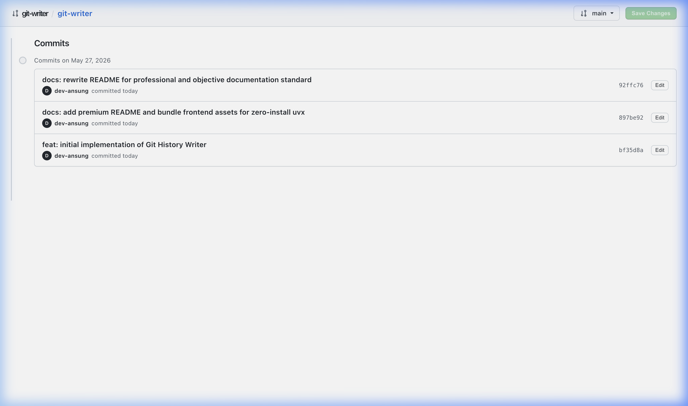

# Git History Writer (`git-writer`)

An interactive local web utility for viewing and modifying Git repository history. `git-writer` provides a visual interface to safely perform history rewrites, replacing complex manual interactive rebasing operations with a structured graphical editor.



---

## Motivation

Managing commit metadata across repository history is frequently necessary but mechanically complex. Developers often need to adjust history to:
* Correct typographical errors in historical commit messages.
* Align author names and emails with organizational standards (e.g., correcting mismatched work/personal identities).
* Append metadata elements like `Co-Authored-By` footers to older commits.
* Adjust commit timestamps to reflect actual task completion times.

### Limitations of Standard Tooling
Git's native `git commit --amend` is restricted to the latest commit. Modifying older commits traditionally requires executing:
```bash
git rebase -i HEAD~n
```
This process drops the operator into a terminal-based editor, requiring manual line flags (`pick`, `edit`, `reword`). It is highly susceptible to syntax errors, command state confusion, and destructive history changes without simple recovery pathways.

### The git-writer Architecture
`git-writer` solves this problem by exposing a clean, standalone local web interface running on top of FastAPI and React, designed in accordance with the GitHub Primer system. It allows developers to:
1. View history chronologically inside an interactive timeline.
2. Select any commit to modify its message, author details, email, timestamps, or co-author metadata.
3. Validate and execute atomic Git history rewrites via a backend service.
4. Maintain operational security through automatic, transparent repository backups prior to any disk mutation.

---

## Zero-Installation Quickstart

Using the `uv` toolchain, `git-writer` can be executed instantly on any local repository without system-wide package installation:

```bash
uvx --from git+https://github.com/dev-ansung/git-writer git-writer [path-to-repository]
```

*Note: If no path is specified, the application defaults to the current working directory.*

Once the server initializes, open `http://127.0.0.1:8000` in your web browser.

---

## Safety and Recovery Mechanisms

Rewriting Git history mutates the repository's DAG (Directed Acyclic Graph) and updates downstream commit hashes. To guarantee absolute data integrity, the application enforces the following lifecycle:

1. **Automatic Backup Generation:** Before executing any rewrite, `git-writer` compresses the current active `.git/` directory and archives it to `.git/git-writer-backups/backup_[timestamp].tar.gz`.
2. **Atomic Execution:** The history rewrite is executed programmatically. If any unexpected Git conflict occurs, the operation is aborted.
3. **Restoration Pathway:** In the event of an unintended state change, the original repository metadata can be restored by expanding the archived backup tarball back into the root of the repository.

---

## Design and Visual Standards

The user interface is built to native developer tool standards:
* **Primer Design System:** Follows standard GitHub visual hierarchies, color variables, and interactive components.
* **Fluid Layout:** Optimized for widescreen development monitors, featuring a 100% responsive fluid view that maximizes timeline readability.
* **Centered Grid Spacing:** The visual commit timeline is governed by pure CSS grid alignments, ensuring subpixel-perfect node alignments across different viewports and zoom levels.

---

## Local Development and Contribution

To run the codebase from source or set up a local development environment:

### Prerequisites
* [Astral uv](https://github.com/astral-sh/uv) (Python package manager)
* [Node.js](https://nodejs.org/) (Frontend compiler)

### 1. Clone the Repository
```bash
git clone https://github.com/dev-ansung/git-writer.git
cd git-writer
```

### 2. Compile Frontend Assets
Build and package the production React files directly into the Python source distribution directory:
```bash
cd frontend
npm install
npm run build
cd ..
```

### 3. Run the Local Server
Start the backend service targeting your designated Git repository:
```bash
uv run git-writer /path/to/target/repository
```

---

## License

This project is distributed under the MIT License. See `LICENSE` for details.
